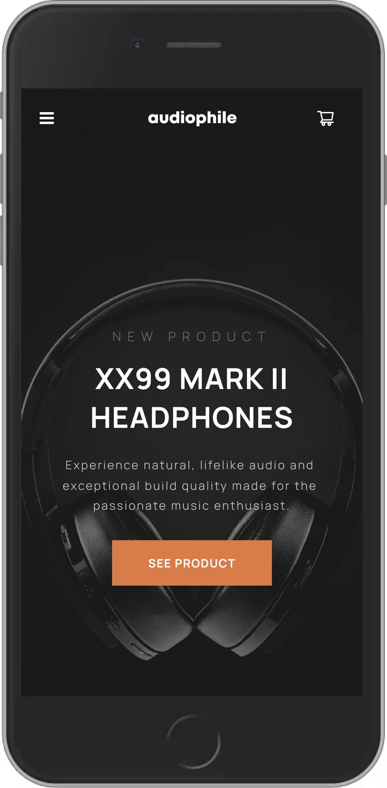
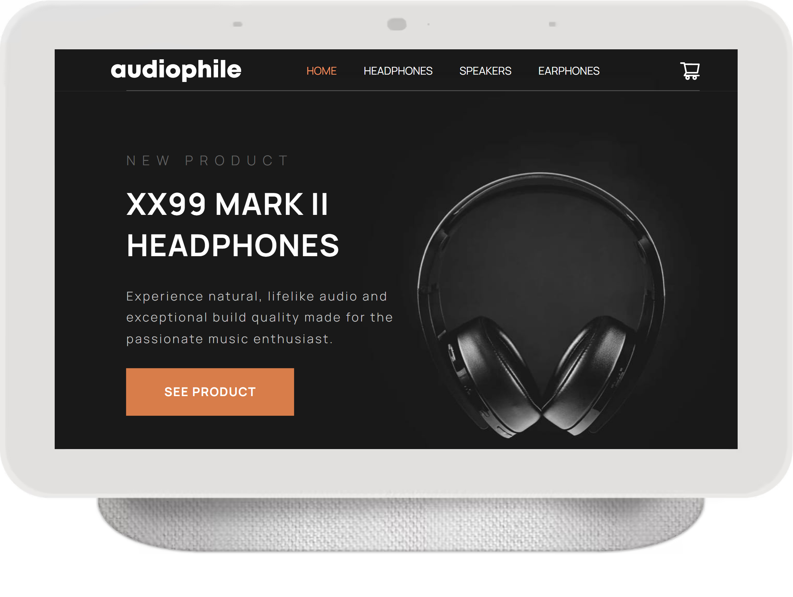

# Audiophile

<div style="display: flex">
&nbsp;&nbsp;
&nbsp;&nbsp;
</div>

<br>
<br>

A React-based, fully responsive website that uses JSON data and combines creative & responsive design along with, high-end audio gear.

This project was a lovely opportunity to follow a provided, structured Figma design and bring to life. The main challenge was implementing the design and its nuances, with drastic changes to the layout in terms of responsiveness, adding a certain degree of complexity, especiallly when trying to maintain DRY code.

It implements lazy loading and it is based on TypeScript, React Router, Redux Toolkit, Styled Components and Framer Motion. For a detailed overview, please have a look at the [**Features**](#features) & [**Tech**](#tech) section.

**Note**: All of the image assets, along with the design files were provided by Frontend Mentor, as part of the [_Audiophile e-commerce website_](https://www.frontendmentor.io/challenges/audiophile-ecommerce-website-C8cuSd_wx) challenge.

<br>

## Installation

As this project was bootstrapped with React, the following scripts are available:

**Install** the dependencies:

```
npm install
```

Run the app in **development** mode:

```
npm start
```

<br>

## <a id='features'></a>Features

- Add-to-cart and checkout flow.
- JSON-provided data with a custom hook to facilitate only essential data extraction.
- Regex-based form field validation and separate error feedback.
- Fully-responsive in both landscape & portrait mode.

<br>

## <a id='tech'></a>Tech

- React
- TypeScript
- React Router
- React Hook Form
- Redux Toolkit
- UUID
- Styled Components
- Lodash
- React Content Loader
- React Icons

For a more detailed overview of the development & production dependencies, please check `package.json`.

<br>

## Live Version

<https://developedbygeo.github.io/Audiophile/>

<br>

## Contributing

Contributions are certainly welcome. Please feel free to open an issue/PR if there is something you would like to be changed.

<br>

## Acknowledgements

A massive thank you to The Odin Project, freeCodeCamp & Frontend Mentor for their guidance and quality material.

<br>

## License

[MIT](./LICENSE.md)
